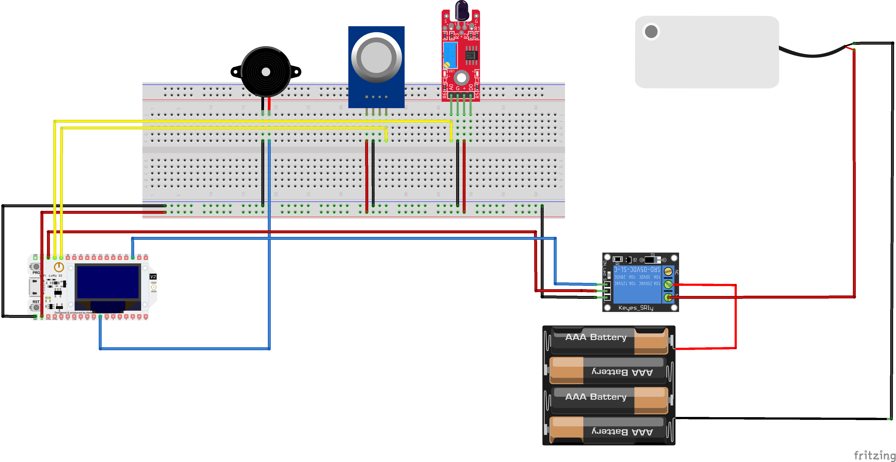
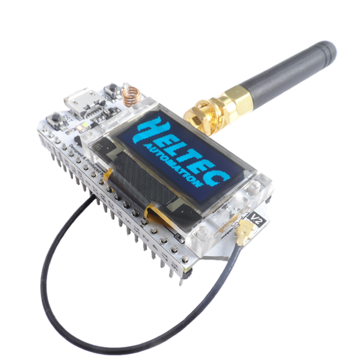
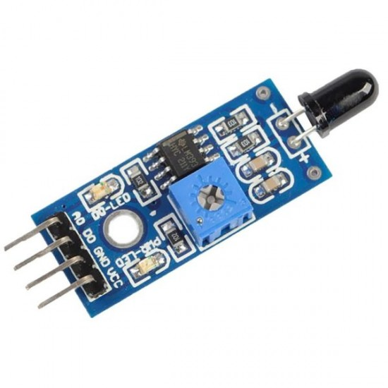
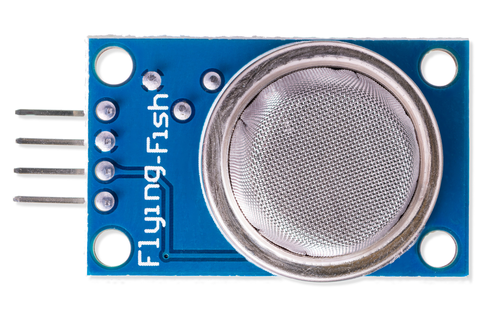
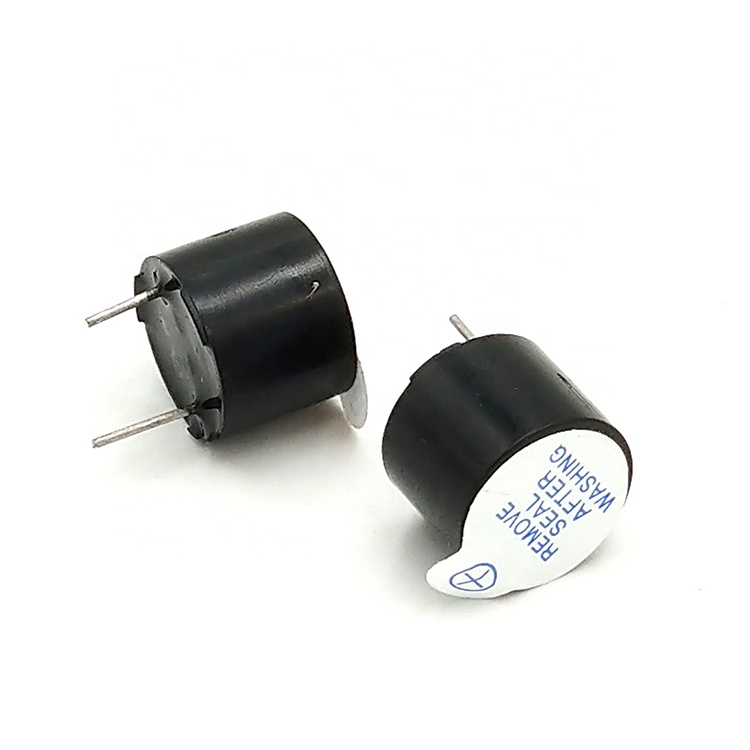
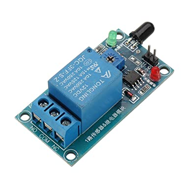
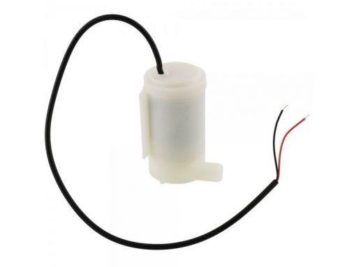
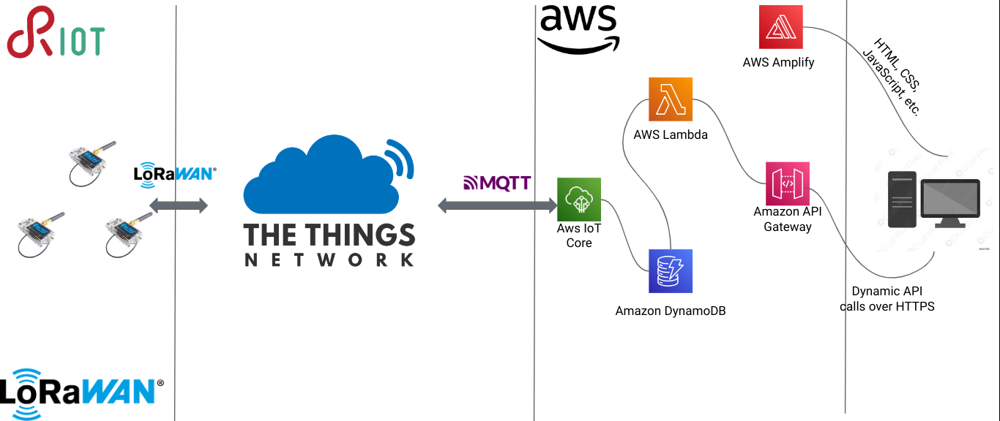

# FLAMEX
**FLAMEX** (**F**lame **A**lert **M**onitoring and **EX**tinguishing System) - Individual IoT Project

FLAMEX is an IoT project designed to detect fires and extinguish them automatically. The system uses an ESP32 Heltec LoRa32 V2 board, Riot OS, and AWS IoT Core, DynamoDB, MQTT, and Wi-Fi connection to communicate and store data. 

The problem I aim to address is the detection of fire and gas leaks in a building or residential environment. These incidents pose serious risks to life and property and require timely detection and response.

IoT technology enables us to create a connected fire alarm system that enhances traditional fire detection capabilities.

Application Scenario: develop a smart fire alarm system for residential buildings. The system will continuously monitor the environment for fire and gas hazards, allowing for early detection and rapid response. By integrating IoT capabilities, the system can provide notifications, automate emergency protocols, and facilitate remote monitoring and control.

## Architecture

The circuit is the following:



Let's see the hardware components.

## Components

### Board

#### ESP32 Heltec LoRa32 v2
 
The Heltec LoRa32 v2 is a development board with 8 MB Flash that uses the EPS32 chip directly. It integrates:
- a SemTech SX1276 or SX1278 for LoRaWAN communication and
- a SSD1306 0.96-inch 128x64 OLED display connected via I2C. 

### Sensors

#### KY-026 Flame Sensor Module
 
The KY-026 Flame Sensor module detects infrared light emitted by fire.
This module consist of a 5mm infra-red receiver LED, a LM393 dual differential comparator, a 3296W trimmer potentiometer, 6 resistors,2 indicator LEDs and 4 male header pins. The board features an analog and a digital output.

- Operating Voltage	3.3V ~ 5.5V
- Infrared Wavelength Detection	760nm ~ 1100nm
- Sensor Detection Angle	60°
- Board Dimensions	1.5cm x 3.6cm [0.6in x 1.4in]

#### MQ-2 Gas Sensor Module
 
The MQ-2 gas sensor is used to detect or monitor the concentration and/or presence of combustible gases in the air. It detects LPG, Smoke, Alcohol, Propane, Hydrogen, Methane and Carbon Monoxide concentrations.

- Operating voltage	5V
- Load resistance	20 KΩ
- Heater resistance	33Ω ± 5%
- Heating consumption	<800mw
- Sensing Resistance	10 KΩ – 60 KΩ
- Concentration Range	200 – 10000ppm

### Actuators

#### Active Buzzer
 
This buzzer is an active buzzer, which basically means that it will buzz at a predefined frequency (2300 ±300 Hz) on its own even when you just apply steady DC power.

- Operating Voltage 3.5V ~ 5.5V
- Maximum Current 30mA / 5VDC
- Minimum Sound Output 85dB @ 10cm
- Resonant Frequency	2500 ±300 Hz
- Operating Temperature	-20°C to 45°C

#### Relay
 
Relay is an electromechanical device that uses an electric current to open or close the contacts of a switch. Thanks a single channel relay shield, it is possible to turn on and off lamps, fans, solenoids, and other small appliances that run on up to 250VAC or DC power.

- Supply voltage – 3.75V to 6V
- Quiescent current: 2mA
- Current when the relay is active: ~70mA
- Relay maximum contact voltage – 250VAC or 30VDC
- Relay maximum current – 10A

#### Water pump
 
This is a low cost, small size Submersible Pump Motor which can be operated from a 2.5 ~ 6V power supply. It can take up to 120 liters per hour with very low current consumption of 220mA.

- Operating Current : 130 ~ 220mA
- Operating Voltage : 2.5 ~ 6V
- Flow Rate : 80 ~ 120 L/H
- Maximum Lift : 40 ~ 110 mm
- Driving Mode : DC, Magnetic Driving
- Continuous Working Life : 500 hours
- Material : Engineering Plastic
- Outlet Outside Diameter : 7.5 mm
- Outlet Inside Diameter : 5 mm

## Network Architecture



### IoT Devices with RIOT OS
The pet tracking system utilizes IoT devices equipped with the RIOT OS (Real-Time Operating System). These devices, such as the ESP32 v2 Heltec LoRa board, incorporate the necessary hardware components, to track and monitor pets effectively. RIOT OS provides a lightweight and efficient operating system tailored for resource-constrained IoT devices, ensuring optimal performance and low power consumption.

### The Things Network (TTN)
The Things Network plays a crucial role in the pet tracking system's network architecture. TTN serves as the LoRaWAN infrastructure provider, enabling secure and reliable communication between the IoT devices and the cloud service. It facilitates the seamless transmission of location data from the IoT devices to the cloud service, ensuring efficient data flow and connectivity.

### Python client for interfacing with TTN
To facilitate the configuration of geofence boundaries, a Python TTN client is employed. This client interacts with TTN to provide the precise coordinates of the geofence to the IoT devices. By leveraging this client, the system establishes an effective means of defining and updating the designated area in which pets should remain.

### Amazon Web Services

The pet tracking system leverages several components within the AWS ecosystem to enable data storage, processing, and web interface access. The components utilized include:

- AWS IoT Core: It serves as the central hub for communication between the pet tracking devices and the cloud service. AWS IoT Core enables secure and reliable data exchange and facilitates seamless integration with other AWS services.

- DynamoDB: This NoSQL database service is employed for storing the pet's location data. DynamoDB offers scalability, high performance, and low latency access, ensuring efficient storage and retrieval of location data.

- Lambda Functions: AWS Lambda functions are utilized to perform various operations on the pet's location data, including encryption, decryption, and data processing. These serverless functions enable real-time data manipulation and facilitate seamless integration with other AWS services.

- Amplify: AWS Amplify simplifies the development process by providing a set of tools and services for building scalable and secure web applications. It enables the creation of a user-friendly web interface for pet owners to access real-time location data and receive alerts.

- API Gateway: AWS API Gateway acts as the entry point for the web interface, providing a secure and scalable API endpoint. It enables seamless communication between the web interface and the backend services, ensuring a smooth user experience.

## How to run

### Prerequisites

- Docker
- AWS account
- Mosquitto
- [Bridge Mosquitto MQTT Broker to IoT](https://aws.amazon.com/it/blogs/iot/how-to-bridge-mosquitto-mqtt-broker-to-aws-iot/)

### Before Starting
Clone the repository
```
https://github.com/francesco-fortunato/FLAMEX.git
```

### Init and update the submodules
Execute `cd FLAMEX`.

#### Init submodule
```
git submodule init
```
#### Update the submodule
```
git submodule update
```

## Wi-fi

### Setup

You first need to add your AWS certificates in the `src/w-fi/Paho Python Client` folder, the following are needed:
- `Paho Python Client/root-CA.crt`
- `Paho Python Client/<name>.private.key`
- `Paho Python Client/<name>.cert.pem`

Moreover be sure to have `pyconfig` installed. You have to add also a pyconfig.py file in which you have to define the relative path of those certificates along with your AWS endpoint and your broker address. 

### Configuration

First of all you have to start mosquitto with the following command inside its folder: `./broker_mqtts broker.conf`.

Then, you have to go in `src/w-fi/Paho Python Client` and run the following command: `python3 MQTTClient.py`.

Finally you have to modify the IP address inside the `src/wi-fi/main.c` file, and you have to edit the `WIFI_SSID` and `WIFI_PASS` with your hotspot wi-fi.

### Run

Now, you can flash the board using the command `sudo BOARD=esp32-heltec-lora32-v2 BUILD_IN_DOCKER=1 DOCKER="sudo docker" PORT="/dev/ttyUSB0" make all flash term`

## LoRa

### Run

For the LoRa part, you have simply to run `sudo BOARD=? BUILD_IN_DOCKER=1 DOCKER="sudo docker" PORT="/dev/ttyUSB0" make all flash term` substitue the '?' with your board (it doesn't work for the esp32-heltec-lora32-v2 board).

## Links

- [User Interface](https://main.d21pf4jxloa0cz.amplifyapp.com/)
- [Blog Post](https://www.hackster.io/francescofortunato1999/a-low-power-fire-alert-system-application-with-riot-os-cdb669)
- [Video Demonstration](https://youtu.be/Z1_pUY_jkf4)
